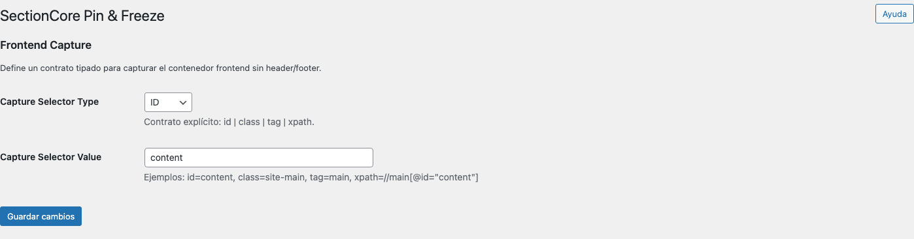

# Pin & Freeze

## Resumen
Pin & Freeze define el contrato de captura del contenedor principal del frontend. En términos prácticos, esta pantalla te permite decirle a la suite qué selector representa el cuerpo útil del sitio sin header ni footer, usando un tipo de selector explícito y su valor.

La clave aquí no es “elegir cualquier selector”, sino elegir el selector más estable del theme activo.

## Qué podés hacer desde esta pantalla
- Elegir el tipo de selector usado para capturar el contenedor frontend.
- Definir el valor del selector según el tipo elegido.
- Guardar un contrato tipado y más claro que el selector legacy en texto libre.

## Cómo leer esta pantalla
La configuración se compone de dos campos:

| Campo | Qué define | Ejemplo válido |
| --- | --- | --- |
| `Capture Selector Type` | La familia del selector | `ID`, `Class`, `Tag` o `XPath` |
| `Capture Selector Value` | El valor exacto del selector | `content`, `site-main`, `main`, `//main[@id="content"]` |

> Cuando elegís `ID` o `Class`, escribí solo el valor. No agregues `#` ni `.` porque el tipo ya define cómo se interpreta.

## Configuración recomendada por defecto
| Escenario | Recomendación |
| --- | --- |
| Theme clásico o FSE con contenedor principal estándar | `Tag = main` |
| Theme con `id="content"` estable | `ID = content` |
| Theme con clase principal estable | `Class = site-main` |
| Estructura compleja o muy personalizada | `XPath` solo si no hay una opción más simple |

## Paso a paso recomendado
1. Identificá el contenedor principal del frontend.
2. Elegí el tipo más estable posible en este orden: `ID`, `Class`, `Tag`, `XPath`.
3. Escribí el valor del selector sin adornos innecesarios.
4. Guardá los cambios.
5. Validá que el resultado siga apuntando al contenedor correcto en las páginas principales del sitio.
6. Si el theme cambia su markup, revisitá esta pantalla.

## Ejemplo completo
Para `Inmobiliaria SectionCore`, imaginá que el contenido principal vive dentro de `<main id="content">`.

1. En `Capture Selector Type` elegís `ID`.
2. En `Capture Selector Value` escribís `content`.
3. Guardás la configuración.
4. Validás que el sistema siga apuntando al contenedor principal de `Inicio`, `Servicios` y `Contacto`.

Si el theme no usa un `id` estable pero sí una clase principal única, el reemplazo natural sería `Class = site-main`.

## Errores frecuentes y cómo evitarlos
> **Error frecuente:** escribir `#content` cuando el tipo ya es `ID`.  
> **Cómo evitarlo:** en `Value` escribí solo `content`.

> **Error frecuente:** usar un selector demasiado frágil o específico.  
> **Cómo evitarlo:** priorizá un selector estable del contenedor principal, no un fragmento profundo del layout.

> **Error frecuente:** usar `XPath` cuando un `id`, `class` o `tag` sería suficiente.  
> **Cómo evitarlo:** `XPath` debería ser el último recurso.

## Validación final esperada
- El selector guardado coincide con la estructura real del theme.
- El contrato queda definido con un tipo y un valor coherentes.
- El selector apunta al contenedor principal y no a una zona parcial del sitio.
- La configuración sigue siendo válida cuando recorrés las páginas principales.

## Siguiente paso
Con el contrato de captura definido, conviene revisar el estado operativo del sitio antes de exportar o desbloquear templates desde [Credits](help://credits).
